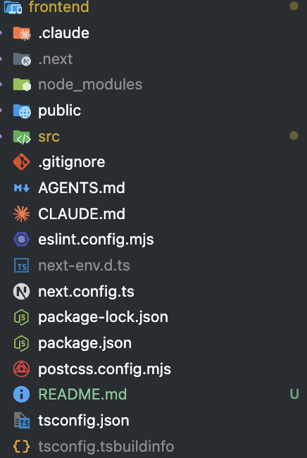
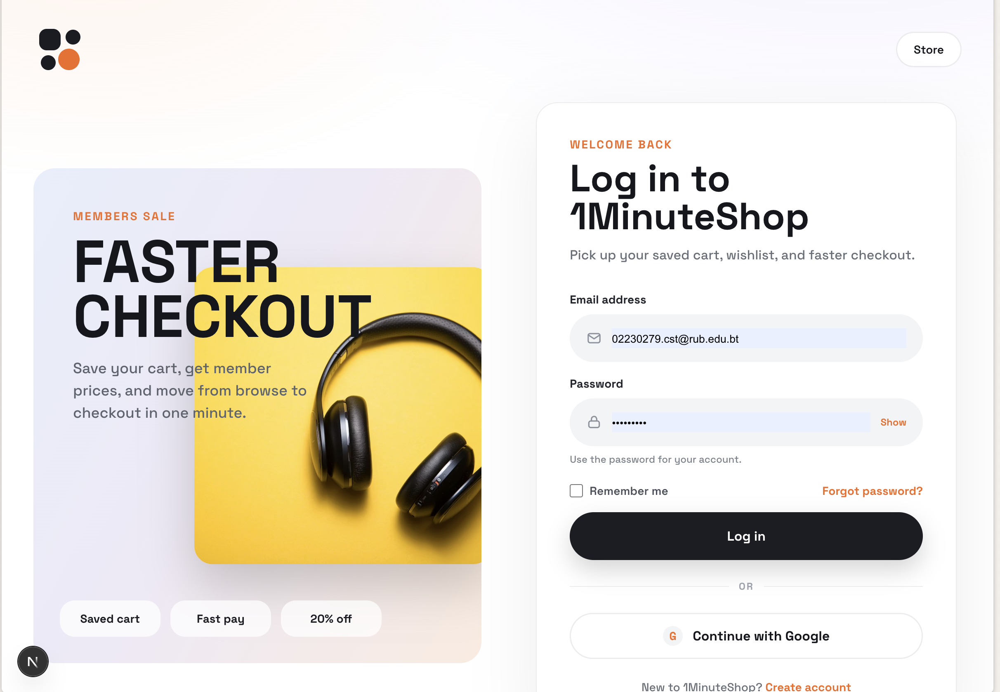
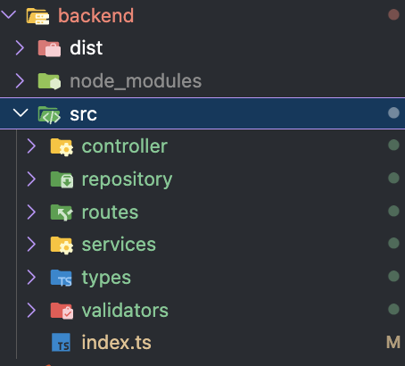

# teachstack
1. nextjs- frontend
2. hono dev -basckend
3. prisma - database orm 
4. mongodb - database
5. tailwindcss - styling

## 1. nextjs frontend setup  and ui development
- create next app

```bash
npx create-next-app@latest frontend
cd frontend
npm run dev
```


- develop ui using ecommmerce plateform

- create email password login and signup pages



- create backend endpoiints for user auth.
## 2. hono dev backend setup and development


- create endpoints for user auth.


