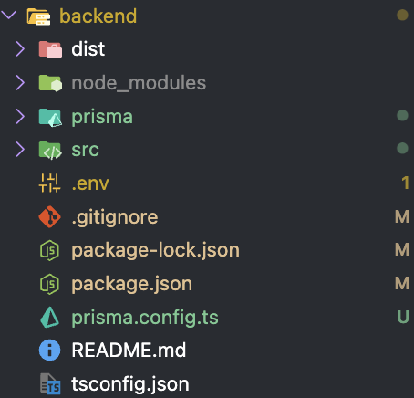
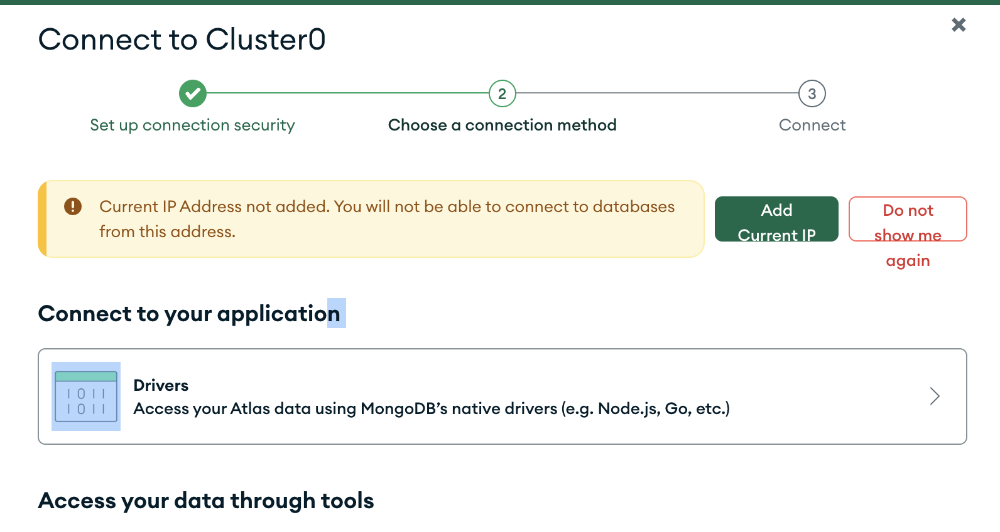
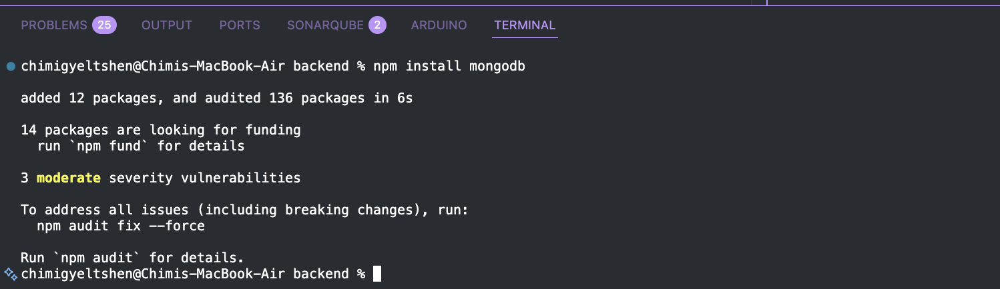
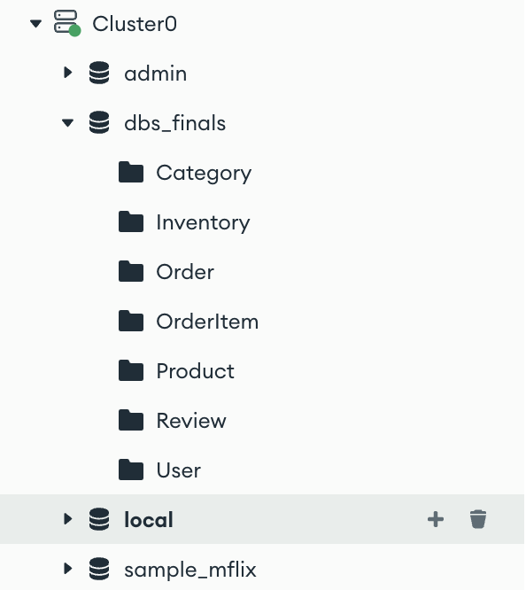
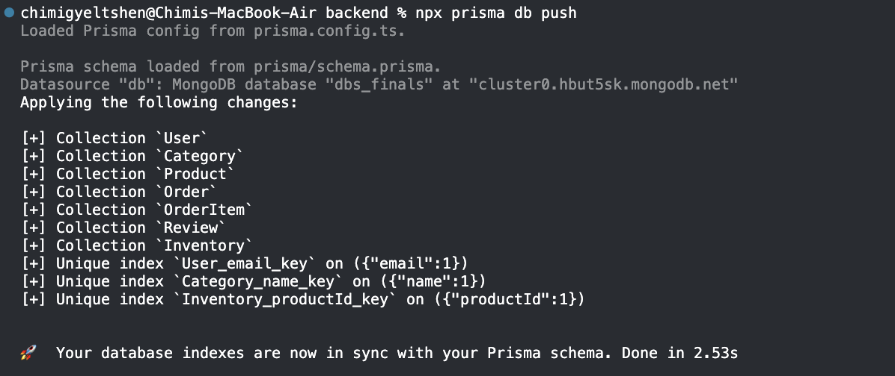
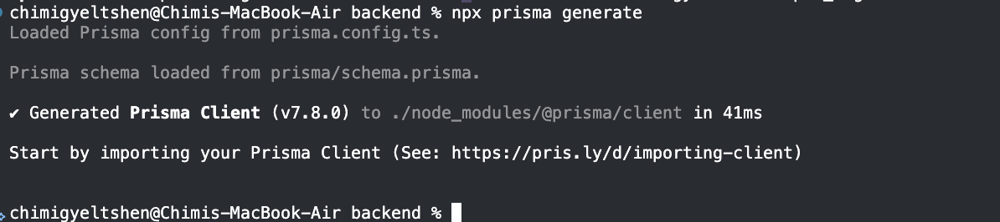

## inalled prisma orm on backend.
- install prisma and create schema
```bashnpm install prisma --save-dev
npx prisma init
```

- connect to clustoer 0 unsing driver mongodb


- Choose Node.js — copy the connection string and paste it in the .env file

```bash
npm install mongodb
```


- Add your connection string into your application .env file

```bash
mongodb+srv://<db_username>:<db_password>@cluster0.hbut5sk.mongodb.net/?appName=Cluster0
```

- create dbs-finsl database and collection in mongodb


- create user model in prisma schema and push schema to db
```bash
 npx prisma db push 
 npx prisma generate
```




