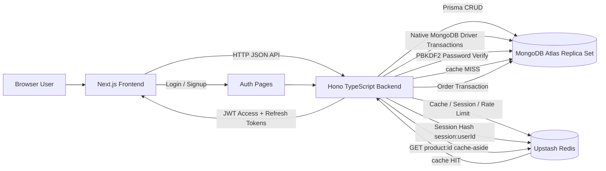

# 1MinuteShop

**Module:** DBS302 — NoSQL Database Management  
**Project:** 1MinuteShop E-Commerce Platform  
**Date:** June 2026  
**Stack:** Next.js, Hono, TypeScript, Prisma, MongoDB Atlas, Upstash Redis

## Abstract

1MinuteShop is a full-stack e-commerce system developed to demonstrate practical NoSQL database design, polyglot persistence, caching, transactions, analytics, and non-functional system qualities. The frontend is implemented with Next.js 16, React 19, TypeScript, and Tailwind CSS. The backend uses Hono with TypeScript and exposes authentication, product, cart, order, analytics, and user activity APIs. MongoDB Atlas is used as the primary database because its flexible document model fits product catalog data, user profiles, orders, reviews, and inventory records. Prisma ORM is used for standard CRUD access, while the native MongoDB driver is used for multi-document ACID transactions because Prisma does not support MongoDB transactions. Upstash Redis is used as a secondary data platform for caching, sessions, rate limiting, carts, recently viewed products, trending leaderboards, and unique visit estimation. The completed system includes JWT authentication with refresh token rotation, Redis cache-aside product reads, MongoDB aggregation pipelines, transaction-safe order placement, and documented strategies for performance, scalability, high availability, consistency, durability, security, observability, and data integrity.

## System Architecture Diagram



The architecture separates presentation, business logic, primary persistence, and low-latency Redis use cases. Next.js is responsible for the user interface and protected route experience. Hono provides a small, fast HTTP API layer. MongoDB Atlas stores durable business data. Redis stores high-speed, short-lived, or derived data that improves performance but is not the primary source of truth.

## Technology Selection Justification

MongoDB was selected as the primary database because e-commerce data is naturally document-oriented. Products contain tags, JSON attributes, and embedded variants; users contain embedded addresses; orders and reviews reference users and products. A relational database could model this data, but MongoDB reduces impedance mismatch for flexible catalog documents and allows the product schema to evolve without disruptive migrations. MongoDB also supports indexes, aggregation pipelines, replica sets, and ACID transactions, which makes it suitable for both operational and analytical requirements.

Redis was selected as a complementary data store, not as a replacement for MongoDB. Redis is optimized for low-latency access to simple data structures such as strings, hashes, lists, sorted sets, and HyperLogLog. These structures map directly to 1MinuteShop requirements: login rate limiting, checkout rate limiting, cart persistence, session storage, recently viewed products, trending products, and unique page visit estimation.

This design follows polyglot persistence theory: different data models are used for different access patterns. MongoDB stores durable business records, while Redis handles fast transient state and derived analytics. From the CAP theorem perspective, MongoDB Atlas is used with tunable consistency. Stronger consistency is selected for order placement using majority read/write concern, while product browsing accepts eventual consistency for better performance through caching. Redis is used where temporary inconsistency is acceptable, such as product cache freshness and trending scores.

## Data Modeling

### MongoDB Collections

The MongoDB schema contains nine collections:

| Collection | Purpose |
|---|---|
| `User` | Stores customer, seller, and admin accounts |
| `Product` | Stores catalog product documents |
| `Category` | Stores product categories and subcategories |
| `Order` | Stores order headers |
| `OrderItem` | Stores order line items |
| `Review` | Stores customer reviews |
| `Inventory` | Stores product stock records |
| `AccessToken` | Stores hashed access token records |
| `RefreshToken` | Stores hashed refresh token records |

### Embedding vs Referencing

| Data | Design | Justification |
|---|---|---|
| `Address` in `User` | Embedded | Addresses belong to one user and are usually loaded with the user profile or checkout flow. Embedding avoids extra lookups. |
| `Variant` in `Product` | Embedded | Variants are small, product-owned subdocuments and are commonly displayed with the product. |
| `Product` to `Category` | Referenced | Many products share one category, so referencing avoids duplication. |
| `Order` to `User` | Referenced | A user can place many orders. Keeping orders separate prevents unbounded user document growth. |
| `OrderItem` to `Order` and `Product` | Referenced | Order items connect products and orders while preserving historical price and quantity. |
| `Review` to `User` and `Product` | Referenced | Reviews can grow significantly and need independent moderation and product lookup. |
| `Inventory` to `Product` | Referenced | Inventory changes frequently and should not rewrite the product document on every stock update. |
| `AccessToken` / `RefreshToken` to `User` | Referenced | Tokens expire and revoke independently from the user profile. |

### MongoDB Indexes

The schema includes indexes that support product search, product filtering, order history, and review lookup:

```prisma
model Product {
  name        String
  description String
  tags        String[]
  categoryId  String @db.ObjectId
  price       Float

  @@fulltext([name, description, tags])
  @@index([categoryId, price])
}

model Order {
  userId String @db.ObjectId
  status OrderStatus

  @@index([userId, status])
}

model Review {
  productId String @db.ObjectId

  @@index([productId])
}
```

### Redis Key Naming and Data Types

| Redis Type | Key Pattern | Use Case |
|---|---|---|
| String | `product:{id}` | Product detail cache |
| String | `ratelimit:login:{ip}` | Login rate limiting |
| String | `ratelimit:checkout:{userId}` | Checkout rate limiting |
| Hash | `cart:{userId}` | Shopping cart |
| Hash | `session:{userId}` | Auth session |
| List | `recentlyViewed:{userId}` | Recently viewed products |
| Sorted Set | `trending:products:{YYYY-MM-DD}` | Daily trending products |
| HyperLogLog | `visits:{productId}` | Unique product visit estimation |

## Implementation Details

### FR 4.1 — User Authentication and Authorization

Authentication is implemented with email and password credentials. Passwords are salted and hashed using PBKDF2 with SHA-512. On login, the backend verifies the password using the stored salt and `timingSafeEqual`. Successful login returns a JWT access token and refresh token. The raw tokens are not stored in MongoDB; only SHA-256 token hashes are stored. Refresh tokens are rotated, so a used refresh token is revoked and replaced.

```ts
const passwordHash = pbkdf2Sync(password, salt, 100_000, 64, 'sha512').toString('hex')
```

Role-based access control uses three roles: `CUSTOMER`, `SELLER`, and `ADMIN`. The frontend `ProtectedRoute` redirects users to the correct dashboard based on role.

### FR 4.2 — Product Catalog and Search

Products are modeled as MongoDB documents with embedded variants, tags, attributes, category reference, stock, seller ID, and price. Product detail reads use Redis cache-aside. Product search is supported by a text index on product `name`, `description`, and `tags`. Filtered listing is supported by a compound index on `categoryId` and `price`.

```ts
const cachedProduct = await redis.get(`product:${productId}`)
if (cachedProduct) return c.json({ product: JSON.parse(cachedProduct) })
const product = await prisma.product.findUnique({ where: { id: productId } })
await redis.set(`product:${productId}`, JSON.stringify(product), { ex: ttl })
```

### FR 4.3 — Cart and Session Management

Cart persistence uses a Redis Hash. Each user has a `cart:{userId}` key where the field is `productId` and the value is quantity. Every cart write refreshes the TTL to seven days. Sessions use a Redis Hash with a 24-hour TTL. This reduces repeated MongoDB reads for `/auth/me` and supports fast session lookup.

```ts
await redis.hset(`cart:${userId}`, { [productId]: String(quantity) })
await redis.expire(`cart:${userId}`, 604800)
```

### FR 4.4 — Order Placement with ACID Transaction

Order placement uses the native MongoDB driver because Prisma does not support MongoDB multi-document transactions. The transaction creates the order, creates line items, and decrements inventory. If inventory is insufficient for any item, the transaction aborts and no partial writes remain.

```ts
await session.withTransaction(async () => {
  await db.collection('Order').insertOne(order, { session })
  await db.collection('OrderItem').insertMany(items, { session })
  await db.collection('Inventory').updateOne(filter, update, { session })
}, {
  readConcern: { level: 'majority' },
  writeConcern: { w: 'majority' },
})
```

### FR 4.5 — Analytics

Two MongoDB aggregation pipelines were implemented. The monthly revenue report filters delivered orders and groups totals by month. The top-products report groups order items by product ID, sums quantities, and uses `$lookup` to join product names.

```js
[
  { $match: { status: "DELIVERED" } },
  { $group: {
      _id: { year: { $year: "$createdAt" }, month: { $month: "$createdAt" } },
      revenue: { $sum: "$total" }
  }}
]
```

### FR 4.6 — Redis Advanced Data Structures

Redis is used for five distinct data structures. Strings support rate limits and product cache entries. Hashes support carts and sessions. Lists store recently viewed product IDs. Sorted sets track trending products by score. HyperLogLog estimates unique product page visitors without storing every visitor ID.

## Non-Functional Requirement Implementation

### NFR1 — Performance

Performance is improved through Redis cache-aside on product detail reads. Cold requests fetch from MongoDB and store the result in Redis. Warm requests return the cached value and include `X-Cache: HIT`. A k6 benchmark script is provided at `backend/src/scripts/benchmark.js`.

| Endpoint | Cold p95 Latency | Warm p95 Latency | Cache Hit Ratio |
|---|---:|---:|---:|
| `GET /products/:id` | `<fill after k6>` | `<fill after k6>` | `<fill after k6>` |

MongoDB explain analysis is supported by `backend/src/scripts/explain.ts`. The key metric is `nReturned` versus `totalDocsExamined`; a good index should keep examined documents close to returned documents.

### NFR2 — Scalability

The theoretical sharding plan is:

| Collection | Shard Key | Justification |
|---|---|---|
| `Product` | `{ categoryId: 1, _id: 1 }` | Supports category filtering while `_id` improves cardinality. |
| `Order` | `{ userId: "hashed" }` or `{ userId: 1, createdAt: 1 }` | Supports user order history and distributes writes. |
| `User` | `{ email: "hashed" }` | Email is unique, high-cardinality, and used during login. |

Ranged sharding supports locality and range queries. Hashed sharding improves write distribution and reduces hotspots. Products benefit from category locality, while users benefit from hashed distribution.

### NFR3 — High Availability

MongoDB Atlas provides a managed three-node replica set with one primary and two secondaries. Data is replicated through the oplog, and Atlas automatically elects a new primary if failover occurs. Upstash Redis provides managed high availability through provider-managed replication and failover. In a self-hosted Redis Sentinel design, this would require one master, two replicas, and three Sentinel processes.

### NFR4 — Consistency

MongoDB is CP-oriented with tunable consistency. For order placement, majority read and write concern are used because inventory and orders require correctness. Product listings use default read concern because slight staleness is acceptable. Redis cache reads are eventually consistent with MongoDB, but writes that affect business correctness are handled by MongoDB.

### NFR5 — Durability

MongoDB Atlas provides durable storage, journaling, and replica set replication. Majority write concern ensures critical writes are acknowledged by a majority before success. Upstash Redis provides managed durable storage, but Redis data in this project is reconstructable or temporary. Product cache, sessions, carts, rate limits, and leaderboards can be rebuilt from MongoDB or user activity.

### NFR6 — Security

Implemented security controls include PBKDF2 password hashing, per-user salts, JWT signing, token hashing in the database, refresh token rotation, role-based access control, rate limiting, and TLS-backed managed database connections. Recommended improvements include HTTP-only cookies, stricter backend role middleware, secret rotation, MongoDB Atlas IP whitelisting, and VPC/network peering.

### NFR7 — Observability

The backend includes a Hono logger middleware that logs method, path, status, and response time. MongoDB Atlas Performance Advisor and Query Profiler can be used for slow query monitoring. Redis INFO statistics can be retrieved from Upstash using the REST API.

```bash
curl -X GET "$UPSTASH_REDIS_REST_URL/info" \
  -H "Authorization: Bearer $UPSTASH_REDIS_REST_TOKEN"
```

### NFR8 — Data Integrity

Data integrity is enforced during order placement with MongoDB transactions. If stock is insufficient, the transaction throws an error and rolls back all operations. This prevents orders from being created without order items or inventory being decremented without an order.

## Performance Analysis

The product endpoint should be tested twice: first after deleting `product:{id}` from Redis, then again after the cache is warm. The expected result is that warm requests are faster and include `X-Cache: HIT`. MongoDB explain output should show index usage for product listing queries using `categoryId` and `price`.

| Test | Command | Result |
|---|---|---|
| Cold product cache | `k6 run -e PRODUCT_ID=<id> src/scripts/benchmark.js` | `<fill>` |
| Warm product cache | `k6 run -e PRODUCT_ID=<id> src/scripts/benchmark.js` | `<fill>` |
| MongoDB explain | `npx tsx src/scripts/explain.ts` | Inspect `executionStats`, especially `nReturned`, `totalDocsExamined`, and index stage names |

The benchmark design is intentionally simple so that cache behavior is isolated. Before the cold run, the product cache key should be deleted from Redis. The first request should show `X-Cache: MISS` and will include MongoDB read latency. Before the warm run, the same endpoint should be called once to populate Redis. The benchmark should then show `X-Cache: HIT` for repeated product reads. This approach directly demonstrates the performance benefit of Redis cache-aside without mixing it with frontend rendering cost.

## Database Seeding and Demonstration Data

The project includes a Prisma seed script at `backend/prisma/seed.ts`. It creates deterministic demonstration data for the assignment: one seller account, one admin account, ten customer accounts, parent categories with subcategories, fifty products, one inventory record per product, twenty orders, and thirty reviews. Seller and admin records are upserted so re-running the seed does not duplicate those accounts. Other collections are cleared before data is inserted to keep the demonstration environment repeatable.

The seeded seller account is:

```text
seller@1minuteshop.com / seller123
```

The seeded admin account is:

```text
admin@1minuteshop.com / admin123
```

All customer accounts use:

```text
customer123
```

The seed data is designed to support analytics and transaction testing. Orders are spread across the last six months and use statuses such as `PLACED`, `CONFIRMED`, `SHIPPED`, `DELIVERED`, and `CANCELLED`. Reviews are only generated from delivered order items, which preserves the rule that only customers who received a product can review it. Product names are realistic examples such as headphones, running shoes, programming books, kitchen appliances, and sports equipment.

To run the seed:

```bash
cd backend
npx prisma db seed
```

The verified seed output was:

```text
Seed completed successfully.
Users: 12 (seller: seller@1minuteshop.com, admin: admin@1minuteshop.com, customers: 10)
Categories: 15
Products: 50
Inventory: 50
Orders: 20
OrderItems: 59
Reviews: 30
```

This seeded dataset gives enough volume to test product filtering, product details, Redis caching, monthly revenue aggregation, top-products aggregation, customer order history, seller dashboard concepts, admin dashboard concepts, and review lookup queries.

## Challenges Faced and Resolutions

The first challenge was Prisma’s lack of MongoDB multi-document transaction support. This was resolved by using the native MongoDB driver alongside Prisma for the order placement workflow.

The second challenge was cache stampede risk on product cache entries. This was handled using jittered TTL values: `3600 + Math.floor(Math.random() * 300)`, which spreads cache expiry times.

The third challenge was the consistency trade-off between Redis and MongoDB. The solution was to allow eventual consistency for product reads while keeping order placement and inventory changes strongly consistent in MongoDB transactions.

The fourth challenge was Upstash Redis using an HTTP REST API rather than a long-lived TCP client. The backend isolates Redis access behind `backend/src/lib/redis.ts`, keeping route logic clean and making the managed Redis dependency easy to replace if needed.

## Future Enhancements

1. Move JWT storage from `localStorage` to secure HTTP-only cookies.
2. Add payment integration and payment status tracking.
3. Add Atlas Search for more advanced product search.
4. Use Redis Streams for order events and asynchronous notifications.
5. Horizontally scale the Hono backend behind a load balancer.
6. Add backend tests for transactions, rate limiting, and auth flows.
7. Add admin APIs for real dashboard data.
8. Connect seller dashboard forms to product and order APIs.

## Conclusion

1MinuteShop demonstrates how a modern e-commerce backend can combine document modeling, cache design, transactions, analytics, and operational requirements in a single coherent system. MongoDB Atlas is used for durable operational data and analytical queries, while Upstash Redis supports performance-sensitive and temporary data patterns. The project avoids treating NoSQL as a single database choice; instead, it applies different storage technologies to different access patterns.

The most important backend achievement is the order placement transaction. It protects inventory and order integrity by combining order creation, order item creation, and stock decrement in one atomic unit. The most important performance feature is the Redis cache-aside implementation for product details, supported by jittered TTLs and explicit invalidation on update. Together, these features show both correctness and efficiency.

The remaining work is mostly productization: connecting dashboards to real backend APIs, improving token storage with HTTP-only cookies, adding tests, and expanding product/order management. The current implementation is nevertheless a strong foundation for the DBS302 assignment because it addresses data modeling, indexing, aggregation, transactions, caching, security, observability, and non-functional design.

## References

[1] MongoDB, Inc., “Transactions,” MongoDB Manual. [Online]. Available: https://www.mongodb.com/docs/manual/core/transactions/  
[2] MongoDB, Inc., “Guidance for Atlas High Availability,” MongoDB Atlas Architecture Center. [Online]. Available: https://www.mongodb.com/docs/atlas/architecture/current/high-availability/  
[3] MongoDB, Inc., “Performance Advisor,” MongoDB Atlas Documentation. [Online]. Available: https://www.mongodb.com/docs/atlas/performance-advisor/  
[4] Redis Ltd., “Key Eviction,” Redis Documentation. [Online]. Available: https://redis.io/docs/latest/develop/reference/eviction/  
[5] Upstash, “Durable Storage,” Upstash Redis Documentation. [Online]. Available: https://upstash.com/docs/redis/features/durability  
[6] K. Chodorow, *MongoDB: The Definitive Guide*, 3rd ed. Sebastopol, CA, USA: O’Reilly Media, 2019.  
[7] J. L. Carlson, *Redis in Action*. Shelter Island, NY, USA: Manning Publications, 2013.  
[8] P. J. Sadalage and M. Fowler, *NoSQL Distilled: A Brief Guide to the Emerging World of Polyglot Persistence*. Boston, MA, USA: Addison-Wesley, 2012.  
[9] E. A. Brewer, “Towards Robust Distributed Systems,” in *Proc. ACM Symposium on Principles of Distributed Computing*, 2000.
